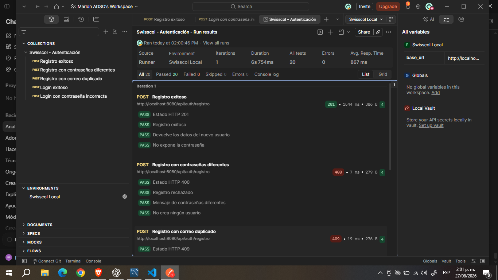
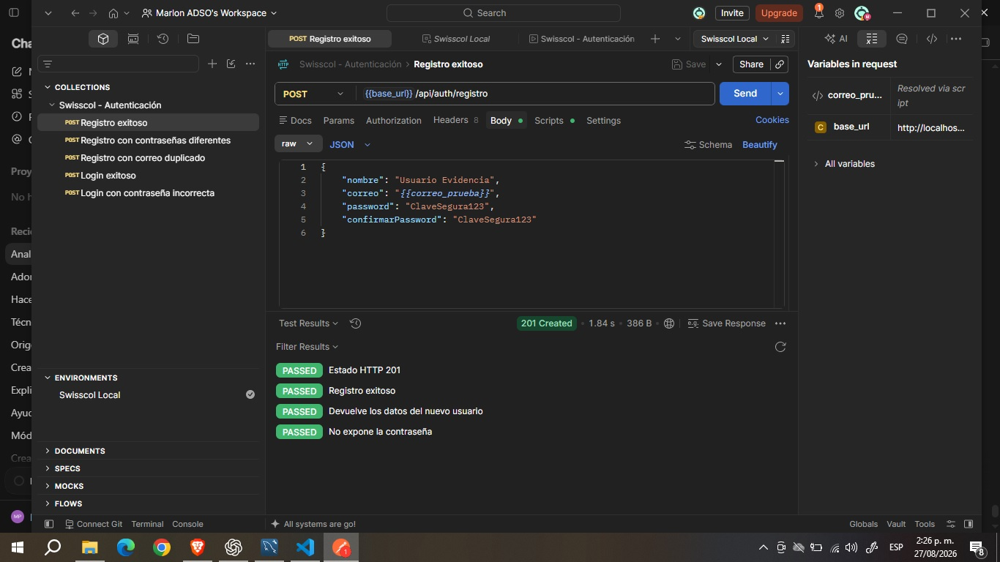
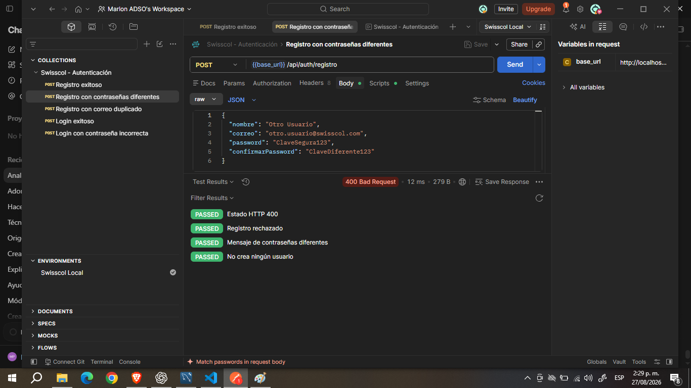
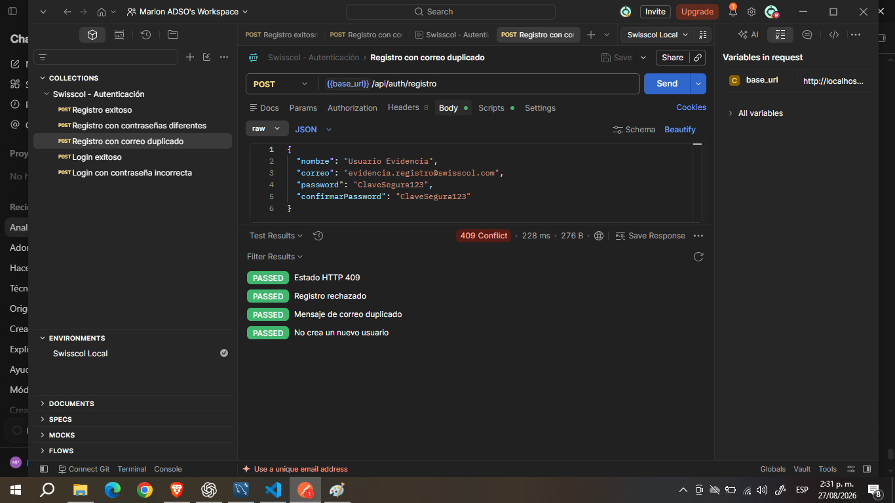
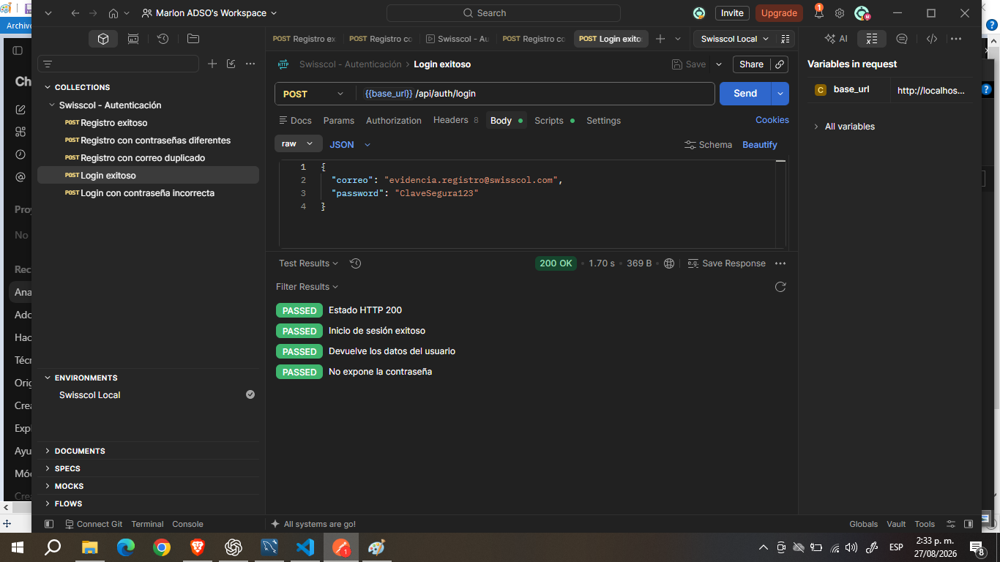
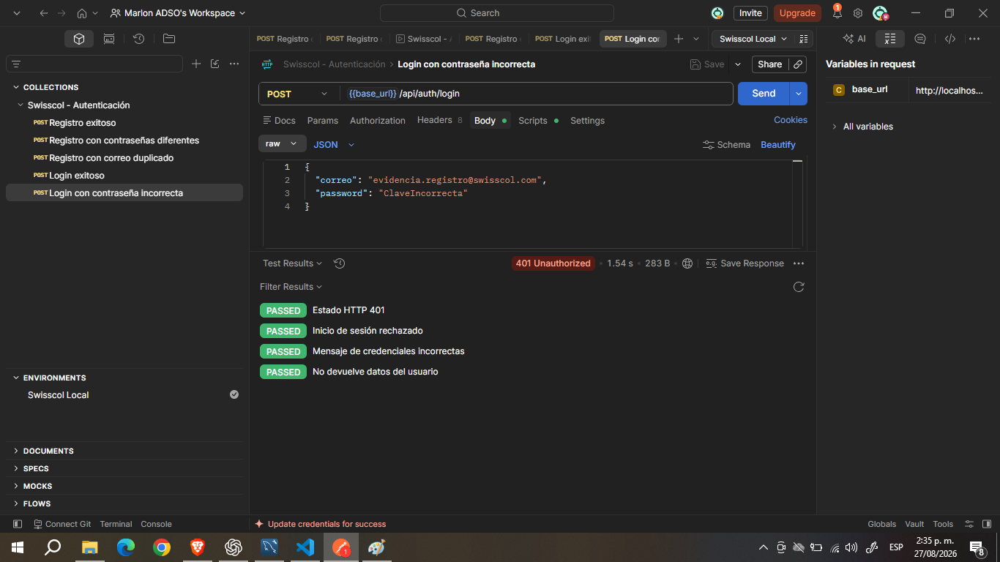

# Pruebas de la API de autenticación — Swisscol

## Información general

- **Evidencia:** GA7-220501096-AA5-EV02
- **Proyecto:** Swisscol
- **Aprendiz:** Marlon Pulido
- **Servicio evaluado:** Registro e inicio de sesión
- **Repositorio:** https://github.com/swisscol26/SwissColJava
- **URL base local:** `http://localhost:8080`

## Objetivo

Comprobar mediante Postman que la API de autenticación de Swisscol responde correctamente ante solicitudes exitosas y situaciones de error. Las pruebas verifican los códigos de estado HTTP, el contenido JSON y la protección de los datos sensibles del usuario.

## Endpoints evaluados

| Método | Endpoint | Función |
|---|---|---|
| POST | `/api/auth/registro` | Registrar un usuario nuevo |
| POST | `/api/auth/login` | Validar las credenciales e iniciar sesión |

## Entorno de pruebas

Para ejecutar las solicitudes se utilizó el entorno de Postman `Swisscol Local`, que contiene la variable:

| Variable | Valor |
|---|---|
| `base_url` | `http://localhost:8080` |

Las solicitudes utilizan las siguientes direcciones:

```text
{{base_url}}/api/auth/registro
{{base_url}}/api/auth/login
```

## Casos de prueba

| Caso | Resultado esperado | Resultado obtenido | Estado |
|---|---:|---:|---|
| Registro exitoso | 201 Created | 201 Created | Aprobado |
| Registro con contraseñas diferentes | 400 Bad Request | 400 Bad Request | Aprobado |
| Registro con correo duplicado | 409 Conflict | 409 Conflict | Aprobado |
| Inicio de sesión exitoso | 200 OK | 200 OK | Aprobado |
| Inicio de sesión con contraseña incorrecta | 401 Unauthorized | 401 Unauthorized | Aprobado |

## Validaciones automatizadas

En cada solicitud se agregaron pruebas automáticas para verificar:

- El código de estado HTTP.
- El valor de la propiedad `exito`.
- El mensaje retornado por la API.
- La presencia de los datos correspondientes al usuario.
- La ausencia de la contraseña y su hash en las respuestas.
- La correcta gestión de solicitudes inválidas.

Para el registro exitoso se genera un correo diferente en cada ejecución, lo cual permite repetir la colección sin producir conflictos por correos duplicados.

## Resultados de la colección

La colección completa se ejecutó utilizando el Collection Runner de Postman.

- **Solicitudes ejecutadas:** 5
- **Pruebas ejecutadas:** 20
- **Pruebas aprobadas:** 20
- **Pruebas fallidas:** 0
- **Errores de ejecución:** 0
- **Iteraciones:** 1
- **Entorno:** Swisscol Local

## Seguridad comprobada

Durante las pruebas se verificaron las siguientes medidas:

- Las contraseñas no aparecen en las respuestas JSON.
- Las contraseñas se almacenan mediante hash PBKDF2.
- Las consultas a la base de datos utilizan sentencias preparadas.
- El registro rechaza correos duplicados.
- El inicio de sesión utiliza un mensaje genérico cuando las credenciales son incorrectas.
- Los usuarios registrados mediante el endpoint público reciben el rol `CUSTOMER`.

## Ejecución de las pruebas

1. Iniciar MySQL y verificar la disponibilidad de la base de datos `database_swisscol`.
2. Ejecutar `ServidorApi.java`.
3. Abrir Postman.
4. Seleccionar el entorno `Swisscol Local`.
5. Abrir la colección `Swisscol - Autenticación`.
6. Ejecutar la colección mediante el Collection Runner.
7. Revisar los códigos HTTP, las respuestas JSON y los resultados automatizados.

## Evidencia visual

## Evidencia visual

### Resultado general de la colección



### Registro exitoso — 201 Created



### Registro con contraseñas diferentes — 400 Bad Request



### Registro con correo duplicado — 409 Conflict



### Inicio de sesión exitoso — 200 OK



### Inicio de sesión con contraseña incorrecta — 401 Unauthorized


## Conclusión

La API de autenticación de Swisscol cumple con las funciones de registro e inicio de sesión. Los cinco escenarios evaluados respondieron con los códigos HTTP y mensajes esperados. Las veinte validaciones automatizadas fueron aprobadas y no se presentaron errores durante la ejecución de la colección.